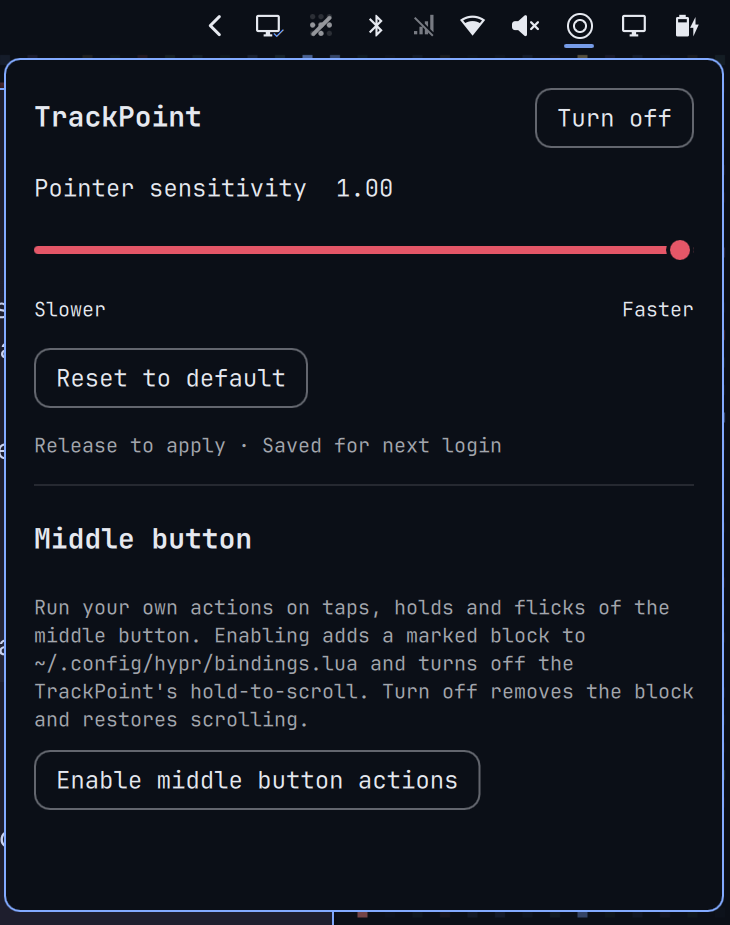

# TrackPoint for maitri

A ThinkPad TrackPoint widget for the maitri bar: a pointer sensitivity slider
and a programmable middle button.

This is a maitri port of [ArtMoreno/omarchy-trackpoint](https://github.com/ArtMoreno/omarchy-trackpoint),
with paths and commands switched over to maitri. Credit for the widget goes to
ArtMoreno and the contributors below.




## Features

- **On / off switch.** *Turn off* makes the TrackPoint inert: moving it or
  pressing its buttons does nothing until you turn it back on. The bar icon
  dims while it is off, and the state is kept for the next login. From a
  keybinding or script:

  ```sh
  maitri-shell io.github.artmoreno.trackpoint device toggle   # or: on, off
  ```

  IPC replies with `queued on`, `queued off`, or `queued toggle` when it accepts
  a request; the panel reports the completed result or error. Requests run in
  order, and toggle reads the saved state when it executes. The bar polls for
  external changes every two seconds when no operation is pending.

- **Sensitivity slider.** Drag and release to set the TrackPoint pointer
  sensitivity from -1 (slower) to 1 (faster). Arrow keys adjust it while the
  panel is focused. Applied instantly and kept for the next login.
- **Middle button actions** (opt-in). Run a command on:
  - a tap, double tap or triple tap
  - a hold, double tap + hold or triple tap + hold
  - a hold + flick up, down, left or right
  - a modifier + tap (Super, Alt, Shift, Ctrl and combinations)
- **Per-app profiles.** Override single actions while a specific app is
  focused, or block the default with "Do nothing".
- Presets for stock maitri commands (menus, screenshots, media, lock screen,
  nightlight, notifications and more), or any custom shell command.
- **Choice of bar icon.** The red *ThinkPad* wordmark, a red TrackPoint dot,
  or the color ThinkPad logo. Pick one under *Bar icon* in the panel, or run:

  ```sh
  maitri bar set io.github.artmoreno.trackpoint logo wordmark   # or: dot, color
  ```

## Requirements

- maitri (plugin manifest `schemaVersion` 1)
- A ThinkPad-style TrackPoint that Hyprland lists with `trackpoint` in its
  name (check with `hyprctl devices`)
- `python3` (preinstalled on maitri)

## Install

```sh
maitri plugin add https://github.com/maitrios/maitri-trackpoint.git --enable
```

The ThinkPad wordmark appears in the bar. Click it to open the panel.

## What it changes on your system

The widget only edits your Hyprland config when you use its controls, and it
checks every change with `hyprctl configerrors`, putting the file back if
Hyprland reports a problem.

Plugin configuration operations share a lock through validation and rollback.
Input-file updates are atomic and preserve symlinks and file permissions.

| When | File | Change |
|---|---|---|
| You move the sensitivity slider | `~/.config/hypr/input.lua` | Sets `sensitivity` in your existing `hl.device` block for the TrackPoint. If you have none, adds a block marked `-- BEGIN io.github.artmoreno.trackpoint device`, removed again when you reset to default. |
| You press **Turn off** next to *TrackPoint* | `~/.config/hypr/input.lua` | Sets `enabled = false` in the same `hl.device` block. **Turn on** removes it again. |
| You press **Enable middle button actions** | `~/.config/hypr/input.lua` | Sets the TrackPoint's `scroll_method` to `"no_scroll"` so a hold isn't taken as hold-to-scroll. Your previous value is saved. |
| You enable actions and assign them | `~/.config/hypr/bindings.lua` | Adds a block marked `-- BEGIN io.github.artmoreno.trackpoint middle button` with binds for the actions you use. |
| You press **Turn off** | both files | Removes the bind block and restores your previous scroll setting. |

Middle button settings are stored in
`~/.local/state/maitri/trackpoint/middle.json`, outside the plugin folder, so
updates keep them.

## Remove

1. Open the panel and press **Turn off** next to *Middle button* (if you
   enabled it). This restores scrolling and removes the bind block.
2. Press **Turn on** if the TrackPoint is off, and **Reset to default** if you
   want Hyprland's default sensitivity back.
3. Remove the plugin:

   ```sh
   maitri plugin remove io.github.artmoreno.trackpoint
   ```

4. Optionally delete the saved middle button settings:

   ```sh
   rm -rf ~/.local/state/maitri/trackpoint
   ```

If you removed the plugin without step 1, delete the block between
`-- BEGIN io.github.artmoreno.trackpoint middle button` and its `-- END` line in
`~/.config/hypr/bindings.lua`, and remove `scroll_method = "no_scroll"` from the
TrackPoint block in `~/.config/hypr/input.lua`, then run `hyprctl reload`.

If the TrackPoint was off when you removed the plugin, use a keyboard-opened
terminal to remove `enabled = false` from its `hl.device` block in
`~/.config/hypr/input.lua`, then run `hyprctl reload config-only`. While the
plugin is installed, you can also recover from a terminal with:

```sh
python3 ~/.config/maitri/plugins/io.github.artmoreno.trackpoint/control.py on
```

## Contributors and thanks

Thank you to [Thord D. Hedengren (@tdhftw)](https://github.com/tdhftw) for
contributing the TrackPoint on/off switch and device IPC commands in
[PR #1](https://github.com/ArtMoreno/omarchy-trackpoint/pull/1), and for testing
them on a ThinkPad X1 Carbon running Omarchy 4.x.

## Development checks

```sh
python3 -m unittest discover -s tests -v
node --test tests/test_device_ipc.cjs
git diff --check
```

These isolated tests use temporary configuration files, a fake `hyprctl`, and
the QML JavaScript handlers. They do not replace live Hyprland/Quickshell
testing on TrackPoint hardware.

## Notes

- Actions run your commands with your user's shell. Custom commands are
  yours to review.
- No network access, no elevated privileges, no background services.

## License

[MIT](LICENSE)
